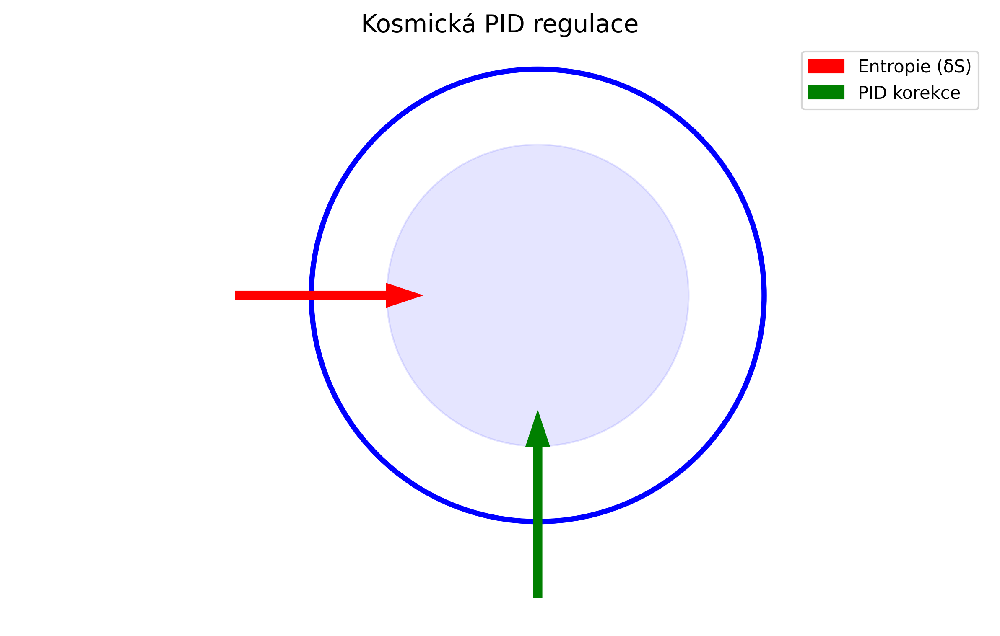

"Do této chvíle jsme jako lidé věděli jak se věci kolem nás projevují a popsali jsme si je matematicky, fyzikálně, chemicky, biologicky apod. Nyní si budeme moci postupně odpovědět na otázku proč takto fungují a projevují se. Smysl nám ale prozatím zůstává záhadou. Možná nám ho někdy řekne nějaký kamarád v restaurantu na konci vesmíru. Stopařův průvodce po galaxii nás teď bude doprovázet."

Marek Zajda

Věda dokáže vysvětlit proč déšť padá, ale už ne proč nám jeho zvuk připadá melancholický.  
Možná až v "Restauraci na konci Vesmíru", kde se entropie obrací a čas teče do strany – nám kamarád pravděpodobně s kvantovým číslem podivnosti +1) pošeptá ten poslední smysl.

"Nepropadejte panice. Smysl je (pravděpodobně) v superpozici."

--------------------------------

"Detekce entropie vyšších dimenzí by byla jako slyšet šepot vesmíru skrze stěny reality."

--------------------------------

"Until now, we as humans have understood how things around us behave, describing them mathematically, physically, chemically, biologically, etc. Now, we may gradually uncover why they function and manifest this way. Yet the ultimate meaning remains a mystery to us. Perhaps someday, a friend at the Restaurant at the End of the Universe will tell us. The Hitchhiker's Guide to the Galaxy shall now be our companion." 

*— Marek Zajda*  

"Science can explain why rain falls, but not why the sound of it feels melancholic to us.  
Perhaps only at the 'Restaurant at the End of the Universe'—where entropy reverses and time flows sideways—will a friend (likely with a strangeness quantum number of +1) whisper that final meaning to us."

"Don't Panic. The meaning is (probably) in the superposition."

-------------------------------------

Detecting higher-dimensional entropy would be like hearing the universe whisper through the walls of reality.

-------------------------------------
# 5D/6D Entropická gravitace s PID regulací

## Systémový diagram


### Popis
- **Modrý kruh**: 5D prostor (bulk)
- **Červená šipka**: Vstup entropie
- **Zelená šipka**: PID korekce

[Zobrazit plné rozlišení](visuals/cosmic_pid_system.png)


## Official Publication  
The full theory is published on Zenodo:  
[](https://doi.org/10.5281/zenodo.15085762)  

## How to Replicate Results  
- Install dependencies: `pip install -r requirements.txt`  
- Run `entropic_gravity_5D.ipynb` to reproduce Figure 2 from the paper.  


## 🚀 Quick Start
```bash
git clone https://github.com/marekzajda/5D_6D-theory-of-entropic-gravity.git
cd 5D_6D-theory-of-entropic-gravity
pip install -r requirements.txt
python holographic_bound.py
